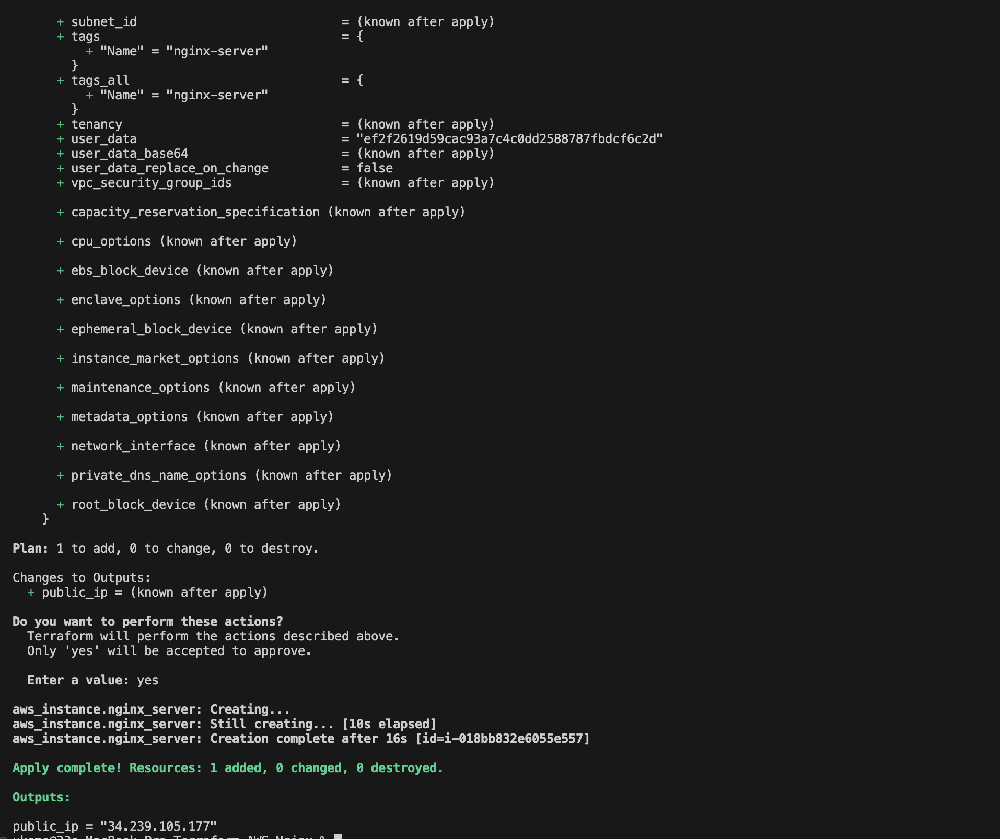

# Terraform-AWS-Nginx
Terraform implementation for provisioning and configuring an Nginx server on AWS EC2

### Prequisites

#### AWS Setup
1. Install AWS CLI tool, to authenticate AWS to your local machine
https://docs.aws.amazon.com/cli/latest/userguide/getting-started-install.html
2. Login to your AWS account, under IAM select user > security > Access Keys
Create an Access key to enable your Authentication
3. Open your terminal in your local machine and use the below command
`aws comfigure` > then input your key and secret
4. to check successful authentication use:
`aws sts get-caller-identity`

#### Create Key pair
1. Log into your AWS account, under EC2, click on keypair.
2. Create a new keypair and download it.
3. You would be needing this key to ssh into your machine

#### Create an S3 Bucket
1. Create an S3 bucket to safe your state file

### How to use

1. change value of `bucket` in backend.tf with your AWS bucket name
2. Run the below commands to implement this repo
    - `terraform init`
    - `terraform plan -var="key_pair_name=your-key-pair"` 
    - `terraform apply -var="key_pair_name=your-key-pair"`

### How to check if its working
1. Restrict permissions to your keypair
`chmod 600 <your-keypair>`
2. ssh into provisioned machine
`ssh -i your-keypair ubuntu@<your-ip-address>`
3. Check the Nginx service
`sudo systemctl status nginx`

4. You can also check in your browser, by checking the public IP

### Method for managing Terraform state
- Remote backend

In this setup, I used an S3 bucket as the remote backend for the following reasons:
1.	Centralized State Management: Ensures that the Terraform state is accessible to multiple collaborators.
2.	State Locking: When paired with DynamoDB, it prevents simultaneous state modifications, avoiding conflicts.
3.	Disaster Recovery: The state file is backed up and durable in S3, reducing the risk of losing infrastructure data.
4.	Automation and CI/CD: Centralized state facilitates integration with pipelines and automation tools.

### Pros, Cons, and Tradeoffs of Remote Backend

| **Aspect**                  | **Advantages**                                                                 | **Disadvantages**                                                   | **Tradeoffs**                                                                                     |
|-----------------------------|-------------------------------------------------------------------------------|---------------------------------------------------------------------|--------------------------------------------------------------------------------------------------|
| **Collaboration**           | State file is accessible to all team members.                                | Requires careful access management (IAM policies).                  | Centralized access improves collaboration but introduces potential security risks if mismanaged. |
| **State Locking**           | Prevents simultaneous updates when combined with a DynamoDB lock table.       | Adds complexity in setting up and maintaining DynamoDB.             | Locking is critical for teamwork but might be unnecessary for single-user setups.               |
| **Disaster Recovery**       | State stored in S3 is highly durable and backed up automatically.             | Depends on S3 availability (rare but possible outages).              | Local backups of state may be needed as a fail-safe.                                            |
| **Security**                | Supports encryption (e.g., S3 bucket policies and KMS encryption).           | Misconfigured policies can expose sensitive data.                   | Requires strict adherence to AWS best practices for securing buckets and keys.                  |
| **Automation**              | Facilitates CI/CD pipelines by providing a central state file.               | Additional configuration needed for pipelines to authenticate.      | Automating deployments is easier but adds setup complexity for pipeline integrations.           |
| **Ease of Setup**           | Straightforward for users familiar with AWS (S3 and DynamoDB).               | Requires S3 and DynamoDB setup, which may be new to some users.     | Simple for experienced AWS users, but steep learning curve for beginners.                       |
| **Cost**                    | Minimal cost for S3 and DynamoDB usage.                                       | Costs increase with scale (e.g., many state files or heavy usage).   | Low cost for most small to medium projects; costlier for large-scale infrastructure.            |
| **Performance**             | Reliable and consistent access to state across regions.                      | Slightly slower than local state (network latency).                  | Minor delay in accessing remote state is a reasonable tradeoff for reliability.                 |